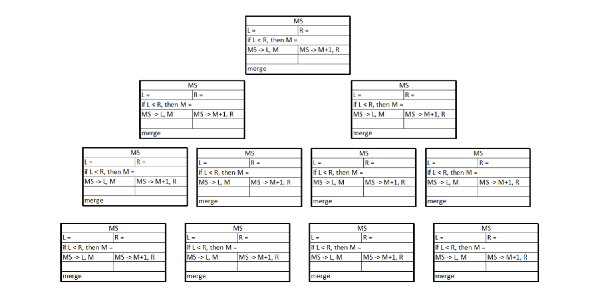
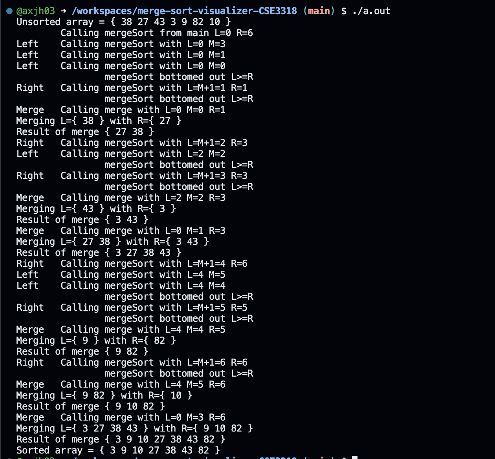

# Merge Sort Visualizer (CSE3318)

This repository contains a merge sort visualizer that demonstrates the process of sorting an array using the merge sort algorithm. The program takes an unsorted array as input and provides step-by-step visualization of the merge sort process, showcasing how the elements are sorted.

